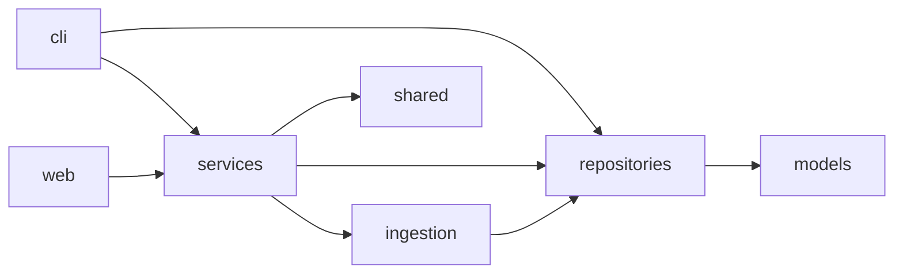

# Living Docs P1 — Foundation Implementation Plan

> **For agentic workers:** REQUIRED SUB-SKILL: Use superpowers:subagent-driven-development (recommended) or superpowers:executing-plans to implement this plan task-by-task. Steps use checkbox (`- [ ]`) syntax for tracking.

**Goal:** Living Docs 体系の P1 基盤を整備し、`make docs-serve` で Docusaurus がローカル起動できる状態にする。L1 自動生成のうち軽量 3 種（`module-index`, `dependency-graph`, `cli-reference`）と、L2 の `system-overview.md` / `current-work.md` 骨格を作る。

**Architecture:** `scripts/gen_docs/` を Python パッケージとして実装し、生成器を責務ごとに分離（`module_index.py` / `dependency_graph.py` / `cli_reference.py` / `coordinator.py`）。生成物は `docs/generated/` および `docs-site/docs/` に clean 再生成方式で出力。Docusaurus は最小構成でセットアップし、生成物を表示するだけのビューワとして機能させる。鮮度保証機構（Skill, `make docs-check`, README, manifest）は P2 以降。

**Tech Stack:** Python 3.10+ stdlib (`ast`, `argparse`, `pathlib`, `shutil`), pytest, Docusaurus 3.x（`@docusaurus/preset-classic`, `@docusaurus/theme-mermaid`, `@easyops-cn/docusaurus-search-local`）, GNU Make, Node.js 18+ + npm

**ADR:** docs/adr/005-living-docs-three-layer.md

---

## File Structure

**Create:**

| Path | Responsibility |
|------|----------------|
| `scripts/gen_docs/__init__.py` | パッケージ宣言（空でよい） |
| `scripts/gen_docs/__main__.py` | `python -m scripts.gen_docs` CLI エントリ |
| `scripts/gen_docs/module_index.py` | `module-index.md` 生成器 |
| `scripts/gen_docs/dependency_graph.py` | `dependency-graph.md` 生成器（Mermaid） |
| `scripts/gen_docs/cli_reference.py` | `cli-reference.md` 生成器（argparse 走査） |
| `scripts/gen_docs/coordinator.py` | clean → generate → copy のオーケストレーション |
| `tests/unit/scripts/__init__.py` | テストパッケージ宣言（空） |
| `tests/unit/scripts/test_module_index.py` | module_index のユニットテスト |
| `tests/unit/scripts/test_dependency_graph.py` | dependency_graph のユニットテスト |
| `tests/unit/scripts/test_cli_reference.py` | cli_reference のユニットテスト |
| `tests/unit/scripts/test_coordinator.py` | coordinator のユニットテスト |
| `docs/system-overview.md` | L2 入口ドキュメント（骨格、§5 の必須セクション） |
| `docs/current-work.md` | L2 進行中作業（mutable） |
| `docs-site/package.json` | Docusaurus 依存 |
| `docs-site/docusaurus.config.js` | Docusaurus 設定 |
| `docs-site/sidebars.js` | サイドバー定義 |
| `docs-site/src/css/custom.css` | カスタムスタイル（空でも可） |
| `docs-site/src/pages/index.jsx` | トップページリダイレクト |
| `Makefile` | `docs` / `docs-serve` / `docs-full` / `docs-clean` ターゲット |

**Modify:**

| Path | 変更内容 |
|------|---------|
| `.gitignore` | 末尾に `docs-site/docs/`, `docs-site/build/`, `docs-site/node_modules/`, `docs/generated/` を追加 |

---

## Task 1: module_index 生成器 (TDD)

**Files:**
- Create: `scripts/__init__.py`, `scripts/gen_docs/__init__.py`, `scripts/gen_docs/module_index.py`
- Modify: `pyproject.toml:60`（`pythonpath`）
- Test: `tests/unit/scripts/__init__.py`, `tests/unit/scripts/test_module_index.py`

- [ ] **Step 1: パッケージファイルを作成**

```bash
mkdir -p scripts/gen_docs tests/unit/scripts
touch scripts/__init__.py scripts/gen_docs/__init__.py tests/unit/scripts/__init__.py
```

`scripts/__init__.py` を作るのは、`scripts.gen_docs` を pytest と `python -m` の
両方から import 可能にするため（既存の `scripts/*.py` は単独実行されるだけで
import されないので、パッケージ化しても影響しない）。

- [ ] **Step 2: `pyproject.toml` の pythonpath に repo root を追加**

現状 `[tool.pytest.ini_options]` の `pythonpath = ["src"]` は `src` しか
sys.path に載せないため、`scripts.gen_docs.*` がテストから import できない。
repo root (`.`) を追加する。

`pyproject.toml:60` を以下に変更:
```toml
pythonpath = ["src", "."]
```

変更後、既存テストが壊れていないことを確認:

Run: `uv run pytest tests/unit/ -q --co 2>&1 | tail -5`
Expected: collection エラーが出ない（テスト件数が表示される）。

- [ ] **Step 3: 失敗するテストを書く**

`tests/unit/scripts/test_module_index.py`:
```python
"""Tests for module-index.md generator."""
from pathlib import Path

import pytest

from scripts.gen_docs.module_index import build_module_index


@pytest.fixture
def fake_src(tmp_path: Path) -> Path:
    """src ライクなディレクトリを作って返す。
    パッケージルート (__init__.py) と 2 つのモジュール (cli, services) を含む。
    """
    pkg = tmp_path / "stock_analyze_system"
    pkg.mkdir()
    (pkg / "__init__.py").write_text("")
    (pkg / "config.py").write_text("X = 1\n")

    cli = pkg / "cli"
    cli.mkdir()
    (cli / "__init__.py").write_text("")
    (cli / "app.py").write_text("def f():\n    return 1\n")

    services = pkg / "services"
    services.mkdir()
    (services / "__init__.py").write_text("")
    (services / "rag_service.py").write_text(
        "class R:\n"
        "    pass\n"
        "def helper():\n"
        "    return 'ok'\n"
    )

    return pkg


def test_build_module_index_lists_top_level_modules(fake_src: Path) -> None:
    md = build_module_index(fake_src)

    # マークダウン本文に各モジュール名と相対パスが含まれる
    assert "cli" in md
    assert "services" in md
    # 行数 (LOC) も含まれる
    assert "LOC" in md or "loc" in md.lower()
    # マークダウンテーブルとして整形されている
    assert "|" in md


def test_build_module_index_excludes_pycache(fake_src: Path) -> None:
    (fake_src / "__pycache__").mkdir()
    (fake_src / "__pycache__" / "junk.pyc").write_bytes(b"")

    md = build_module_index(fake_src)

    assert "__pycache__" not in md


def test_build_module_index_returns_markdown_with_header(fake_src: Path) -> None:
    md = build_module_index(fake_src)

    assert md.startswith("# ")
    assert md.endswith("\n")
```

- [ ] **Step 4: テストが import エラーで失敗することを確認**

Run: `uv run pytest tests/unit/scripts/test_module_index.py -v`
Expected: `ModuleNotFoundError: No module named 'scripts.gen_docs.module_index'`

- [ ] **Step 5: 最小実装を書く**

`scripts/gen_docs/module_index.py`:
```python
"""module-index.md 生成器。

`src/stock_analyze_system/` 配下を走査し、トップレベルモジュールの一覧を
Markdown テーブルで返す。
"""
from __future__ import annotations

from pathlib import Path


EXCLUDED = {"__pycache__", ".egg-info"}


def _is_python_module(path: Path) -> bool:
    return path.is_dir() and (path / "__init__.py").exists()


def _count_loc(path: Path) -> int:
    """配下の .py ファイルの実行コード行数を概算する (空行とコメントを除く)。"""
    total = 0
    for py in path.rglob("*.py"):
        if any(part in EXCLUDED for part in py.parts):
            continue
        for line in py.read_text(encoding="utf-8", errors="replace").splitlines():
            stripped = line.strip()
            if stripped and not stripped.startswith("#"):
                total += 1
    return total


def _count_files(path: Path) -> int:
    return sum(
        1
        for py in path.rglob("*.py")
        if not any(part in EXCLUDED for part in py.parts)
    )


def build_module_index(package_root: Path) -> str:
    """与えられたパッケージルート直下のモジュール一覧 Markdown を返す。"""
    rows: list[tuple[str, int, int, str]] = []
    for child in sorted(package_root.iterdir()):
        if child.name in EXCLUDED:
            continue
        if not _is_python_module(child):
            continue
        rel = f"{package_root.name}/{child.name}"
        files = _count_files(child)
        loc = _count_loc(child)
        readme = f"[README]({rel}/README.md)"
        rows.append((child.name, files, loc, readme))

    lines: list[str] = []
    lines.append(f"# Module Index — `{package_root.name}`")
    lines.append("")
    lines.append("| Module | Files | LOC | README |")
    lines.append("|--------|------:|----:|--------|")
    for name, files, loc, readme in rows:
        lines.append(f"| `{name}` | {files} | {loc} | {readme} |")
    lines.append("")
    return "\n".join(lines)
```

- [ ] **Step 6: テストが pass することを確認**

Run: `uv run pytest tests/unit/scripts/test_module_index.py -v`
Expected: 3 passed

- [ ] **Step 7: コミット**

```bash
git add pyproject.toml scripts/__init__.py scripts/gen_docs/__init__.py \
        scripts/gen_docs/module_index.py \
        tests/unit/scripts/__init__.py tests/unit/scripts/test_module_index.py
git commit -m "feat(docs): add module_index generator for Living Docs L1"
```

---

## Task 2: dependency_graph 生成器 (TDD)

**Files:**
- Create: `scripts/gen_docs/dependency_graph.py`
- Test: `tests/unit/scripts/test_dependency_graph.py`

- [ ] **Step 1: 失敗するテストを書く**

`tests/unit/scripts/test_dependency_graph.py`:
```python
"""Tests for dependency-graph.md generator."""
from pathlib import Path

import pytest

from scripts.gen_docs.dependency_graph import build_dependency_graph


@pytest.fixture
def fake_pkg(tmp_path: Path) -> Path:
    pkg = tmp_path / "stock_analyze_system"
    pkg.mkdir()
    (pkg / "__init__.py").write_text("")

    cli = pkg / "cli"
    cli.mkdir()
    (cli / "__init__.py").write_text("")
    (cli / "app.py").write_text(
        "from stock_analyze_system.services import rag_service\n"
        "from stock_analyze_system.shared import logger\n"
        "import os\n"
        "from typing import Any\n"
    )

    services = pkg / "services"
    services.mkdir()
    (services / "__init__.py").write_text("")
    (services / "rag_service.py").write_text(
        "from stock_analyze_system.shared import logger\n"
    )

    shared = pkg / "shared"
    shared.mkdir()
    (shared / "__init__.py").write_text("")
    (shared / "logger.py").write_text("")

    return pkg


def test_build_dependency_graph_emits_mermaid(fake_pkg: Path) -> None:
    md = build_dependency_graph(fake_pkg)
    assert "```mermaid" in md
    assert "graph" in md or "flowchart" in md


def test_build_dependency_graph_captures_internal_edges(fake_pkg: Path) -> None:
    md = build_dependency_graph(fake_pkg)
    # cli -> services
    assert "cli --> services" in md or "cli-->services" in md
    # cli -> shared
    assert "cli --> shared" in md or "cli-->shared" in md
    # services -> shared
    assert "services --> shared" in md or "services-->shared" in md


def test_build_dependency_graph_ignores_external_imports(fake_pkg: Path) -> None:
    md = build_dependency_graph(fake_pkg)
    # 標準ライブラリは出さない
    assert "os" not in md.replace("# ", "").replace("```", "").replace("graph", "")
    # typing も出さない
    assert " --> typing" not in md


def test_build_dependency_graph_captures_package_root_imports(fake_pkg: Path) -> None:
    repositories = fake_pkg / "repositories"
    repositories.mkdir()
    (repositories / "__init__.py").write_text("")
    cli_extra = fake_pkg / "cli" / "extra.py"
    cli_extra.write_text("from stock_analyze_system import repositories\n")

    md = build_dependency_graph(fake_pkg)

    assert "cli --> repositories" in md or "cli-->repositories" in md
```

- [ ] **Step 2: テストが失敗することを確認**

Run: `uv run pytest tests/unit/scripts/test_dependency_graph.py -v`
Expected: `ModuleNotFoundError: No module named 'scripts.gen_docs.dependency_graph'`

- [ ] **Step 3: 実装を書く**

`scripts/gen_docs/dependency_graph.py`:
```python
"""dependency-graph.md 生成器。

パッケージ配下の Python ファイルを ast でパースし、同一パッケージ内の
モジュール間 import 関係を Mermaid flowchart として出力する。
"""
from __future__ import annotations

import ast
from collections import defaultdict
from pathlib import Path


EXCLUDED = {"__pycache__"}


def _top_level_module_of(rel_parts: tuple[str, ...]) -> str | None:
    """('cli', 'app.py') → 'cli'。深さ 0 のファイル (config.py 等) は None。"""
    if len(rel_parts) < 2:
        return None
    return rel_parts[0]


def _internal_target(import_name: str, package_name: str) -> str | None:
    """import 文の対象が自パッケージ配下なら、トップレベルモジュール名を返す。

    例: `stock_analyze_system.services.rag_service` (package_name='stock_analyze_system')
        → 'services'
    """
    parts = import_name.split(".")
    if parts[0] != package_name or len(parts) < 2:
        return None
    return parts[1]


def _extract_imports(source: str) -> list[str]:
    try:
        tree = ast.parse(source)
    except SyntaxError:
        return []
    names: list[str] = []
    for node in ast.walk(tree):
        if isinstance(node, ast.Import):
            for alias in node.names:
                names.append(alias.name)
        elif isinstance(node, ast.ImportFrom):
            if node.module is not None and node.level == 0:
                names.append(node.module)
                names.extend(f"{node.module}.{alias.name}" for alias in node.names)
    return names


def build_dependency_graph(package_root: Path) -> str:
    """同一パッケージ内のモジュール間依存を Mermaid 図として返す。"""
    package_name = package_root.name
    edges: set[tuple[str, str]] = set()
    nodes: set[str] = set()

    for py in package_root.rglob("*.py"):
        if any(part in EXCLUDED for part in py.parts):
            continue
        rel = py.relative_to(package_root)
        source_module = _top_level_module_of(rel.parts)
        if source_module is None:
            continue
        nodes.add(source_module)
        try:
            src_text = py.read_text(encoding="utf-8", errors="replace")
        except OSError:
            continue
        for imp in _extract_imports(src_text):
            target = _internal_target(imp, package_name)
            if target is None or target == source_module:
                continue
            nodes.add(target)
            edges.add((source_module, target))

    lines: list[str] = []
    lines.append(f"# Dependency Graph — `{package_name}`")
    lines.append("")
    lines.append("```mermaid")
    lines.append("flowchart LR")
    for node in sorted(nodes):
        lines.append(f"  {node}")
    for src, dst in sorted(edges):
        lines.append(f"  {src} --> {dst}")
    lines.append("```")
    lines.append("")
    return "\n".join(lines)
```

- [ ] **Step 4: テストが pass することを確認**

Run: `uv run pytest tests/unit/scripts/test_dependency_graph.py -v`
Expected: 4 passed

- [ ] **Step 5: 実プロジェクトで spot-check**

Run:
```bash
uv run python -c "
from pathlib import Path
from scripts.gen_docs.dependency_graph import build_dependency_graph
print(build_dependency_graph(Path('src/stock_analyze_system')))
" | head -40
```
Expected: `services --> repositories`, `cli --> services` 等が現れる Mermaid 図。

- [ ] **Step 6: コミット**

```bash
git add scripts/gen_docs/dependency_graph.py tests/unit/scripts/test_dependency_graph.py
git commit -m "feat(docs): add dependency_graph generator for Living Docs L1"
```

---

## Task 3: cli_reference 生成器 (TDD)

**Files:**
- Create: `scripts/gen_docs/cli_reference.py`
- Test: `tests/unit/scripts/test_cli_reference.py`

- [ ] **Step 1: 失敗するテストを書く**

`tests/unit/scripts/test_cli_reference.py`:
```python
"""Tests for cli-reference.md generator."""
import argparse

from scripts.gen_docs.cli_reference import build_cli_reference


def _make_parser() -> argparse.ArgumentParser:
    parser = argparse.ArgumentParser(prog="test-prog", description="Test program")
    subparsers = parser.add_subparsers(dest="command")

    sub_hello = subparsers.add_parser("hello", help="Print hello")
    sub_hello.add_argument("--name", type=str, default="world")

    sub_count = subparsers.add_parser("count", help="Count things")
    sub_count.add_argument("--limit", type=int, default=10)

    return parser


def test_build_cli_reference_lists_subcommands() -> None:
    md = build_cli_reference(_make_parser())

    assert "hello" in md
    assert "count" in md
    assert "Print hello" in md
    assert "Count things" in md


def test_build_cli_reference_includes_prog_name() -> None:
    md = build_cli_reference(_make_parser())
    assert "test-prog" in md


def test_build_cli_reference_handles_parser_without_subcommands() -> None:
    parser = argparse.ArgumentParser(prog="empty")
    md = build_cli_reference(parser)
    # 例外を投げず、サブコマンドなしの旨を含む Markdown を返す
    assert "empty" in md
    assert "subcommand" in md.lower() or "no commands" in md.lower()


def test_build_cli_reference_escapes_command_names() -> None:
    parser = argparse.ArgumentParser(prog="escape-test")
    subparsers = parser.add_subparsers(dest="command")
    subparsers.add_parser("pipe|cmd", help="Pipe command")

    md = build_cli_reference(parser)

    assert r"`pipe\|cmd`" in md
    assert "`pipe|cmd`" not in md
```

- [ ] **Step 2: テストが失敗することを確認**

Run: `uv run pytest tests/unit/scripts/test_cli_reference.py -v`
Expected: `ModuleNotFoundError`

- [ ] **Step 3: 実装を書く**

`scripts/gen_docs/cli_reference.py`:
```python
"""cli-reference.md 生成器。

argparse の `ArgumentParser` を受け取り、サブパーサーの一覧を Markdown
テーブルで出力する。プロジェクトの `cli/app.py:build_parser()` をそのまま
渡せる前提。
"""
from __future__ import annotations

import argparse


def _markdown_table_text(value: str) -> str:
    return value.replace("|", r"\|").replace("\n", " ").strip()


def _find_subparsers_action(
    parser: argparse.ArgumentParser,
) -> argparse._SubParsersAction | None:
    for action in parser._actions:  # noqa: SLF001 — argparse 内部 API 利用
        if isinstance(action, argparse._SubParsersAction):  # noqa: SLF001
            return action
    return None


def build_cli_reference(parser: argparse.ArgumentParser) -> str:
    """ArgumentParser からサブコマンド一覧 Markdown を生成する。"""
    prog = parser.prog or "<unknown>"
    description = parser.description or ""

    lines: list[str] = []
    lines.append(f"# CLI Reference — `{prog}`")
    lines.append("")
    if description:
        lines.append(description)
        lines.append("")

    subparsers_action = _find_subparsers_action(parser)
    if subparsers_action is None or not subparsers_action.choices:
        lines.append("_No subcommands defined._")
        lines.append("")
        return "\n".join(lines)

    lines.append("| Command | Description |")
    lines.append("|---------|-------------|")

    # subparsers_action.choices: dict[str, ArgumentParser]
    # subparsers_action._choices_actions: 各サブパーサの help を持つ
    help_by_name = {
        a.dest: a.help or "" for a in subparsers_action._choices_actions  # noqa: SLF001
    }
    for name in sorted(subparsers_action.choices.keys()):
        sub_parser = subparsers_action.choices[name]
        help_text = help_by_name.get(name) or sub_parser.description or ""
        # Markdown の縦棒をエスケープ
        command = _markdown_table_text(name)
        help_text = _markdown_table_text(help_text)
        lines.append(f"| `{command}` | {help_text} |")

    lines.append("")
    return "\n".join(lines)
```

- [ ] **Step 4: テストが pass することを確認**

Run: `uv run pytest tests/unit/scripts/test_cli_reference.py -v`
Expected: 4 passed

- [ ] **Step 5: 実プロジェクトの build_parser() で spot-check**

Run:
```bash
uv run python -c "
from stock_analyze_system.cli.app import build_parser
from scripts.gen_docs.cli_reference import build_cli_reference
print(build_cli_reference(build_parser()))
"
```
Expected: `company`, `financial`, `valuation`, `filings`, `jobs`, `quotes`, `watchlist`, `target`, `screening`, `stooq`, `rag`, `serve`, `worker` がテーブルに並ぶ。

- [ ] **Step 6: コミット**

```bash
git add scripts/gen_docs/cli_reference.py tests/unit/scripts/test_cli_reference.py
git commit -m "feat(docs): add cli_reference generator for Living Docs L1"
```

---

## Task 4: coordinator (clean → generate → copy)

**Files:**
- Create: `scripts/gen_docs/coordinator.py`
- Test: `tests/unit/scripts/test_coordinator.py`

- [ ] **Step 1: 失敗するテストを書く**

`tests/unit/scripts/test_coordinator.py`:
```python
"""Tests for coordinator: clean → generate → copy pipeline."""
from pathlib import Path

import pytest

from scripts.gen_docs.coordinator import GenContext, run_pipeline


@pytest.fixture
def fake_repo(tmp_path: Path) -> Path:
    """疑似 repo: src/<pkg>, docs/, docs-site/docs/ を持つ"""
    repo = tmp_path / "repo"
    repo.mkdir()
    (repo / "docs").mkdir()
    (repo / "docs-site").mkdir()
    (repo / "src").mkdir()

    pkg = repo / "src" / "stock_analyze_system"
    pkg.mkdir()
    (pkg / "__init__.py").write_text("")
    cli = pkg / "cli"
    cli.mkdir()
    (cli / "__init__.py").write_text("")
    (cli / "app.py").write_text("def f():\n    return 1\n")

    return repo


def test_run_pipeline_creates_l1_generated_dir(fake_repo: Path) -> None:
    ctx = GenContext(
        repo_root=fake_repo,
        package_path=fake_repo / "src" / "stock_analyze_system",
        cli_parser=None,  # cli_reference は parser=None でも stub を生成する
    )
    run_pipeline(ctx)

    generated = fake_repo / "docs" / "generated"
    assert (generated / "module-index.md").exists()
    assert (generated / "dependency-graph.md").exists()


def test_run_pipeline_writes_cli_reference_stub_when_parser_is_none(
    fake_repo: Path,
) -> None:
    """parser が None でも cli-reference.md は必ず生成される（stub）。

    sidebars.js は `generated/cli-reference` を常に参照するため、ファイルが
    無いと Docusaurus が broken doc id でビルドに失敗する。欠落させず、
    生成不能の旨を本文に書いた stub を出す。
    """
    ctx = GenContext(
        repo_root=fake_repo,
        package_path=fake_repo / "src" / "stock_analyze_system",
        cli_parser=None,
    )
    run_pipeline(ctx)

    cli_ref = fake_repo / "docs" / "generated" / "cli-reference.md"
    assert cli_ref.exists()
    body = cli_ref.read_text()
    assert body.startswith("# ")
    # 生成不能であることが読み手に分かる
    assert "unavailable" in body.lower() or "生成できません" in body


def test_run_pipeline_cleans_stale_files(fake_repo: Path) -> None:
    """前回実行で残った生成物が削除される。"""
    stale = fake_repo / "docs" / "generated"
    stale.mkdir()
    (stale / "stale.md").write_text("stale content")

    site_docs = fake_repo / "docs-site" / "docs"
    site_docs.mkdir()
    (site_docs / "old.md").write_text("old")

    ctx = GenContext(
        repo_root=fake_repo,
        package_path=fake_repo / "src" / "stock_analyze_system",
        cli_parser=None,
    )
    run_pipeline(ctx)

    # 古いファイルは消える
    assert not (stale / "stale.md").exists()
    assert not (site_docs / "old.md").exists()


def test_run_pipeline_copies_l2_overview_when_present(fake_repo: Path) -> None:
    overview = fake_repo / "docs" / "system-overview.md"
    overview.write_text("# Overview\n\ncontent\n")

    ctx = GenContext(
        repo_root=fake_repo,
        package_path=fake_repo / "src" / "stock_analyze_system",
        cli_parser=None,
    )
    run_pipeline(ctx)

    copied = fake_repo / "docs-site" / "docs" / "overview.md"
    assert copied.exists()
    assert "# Overview" in copied.read_text()
```

- [ ] **Step 2: テストが失敗することを確認**

Run: `uv run pytest tests/unit/scripts/test_coordinator.py -v`
Expected: `ModuleNotFoundError`

- [ ] **Step 3: 実装を書く**

`scripts/gen_docs/coordinator.py`:
```python
"""Living Docs 生成パイプラインのオーケストレーション。

ステップ:
  1. `docs/generated/` と `docs-site/docs/` を rm -rf (clean 再生成)
  2. L1 生成物を `docs/generated/` に出力
  3. L2 (`docs/system-overview.md`, `docs/current-work.md`) を `docs-site/docs/` にコピー
  4. L1 を `docs-site/docs/generated/` にコピー
"""
from __future__ import annotations

import argparse
import shutil
from dataclasses import dataclass
from pathlib import Path

from scripts.gen_docs.dependency_graph import build_dependency_graph
from scripts.gen_docs.cli_reference import build_cli_reference
from scripts.gen_docs.module_index import build_module_index


@dataclass(frozen=True)
class GenContext:
    repo_root: Path
    package_path: Path
    cli_parser: argparse.ArgumentParser | None


def _clean(path: Path) -> None:
    if path.exists():
        shutil.rmtree(path)


def _write(path: Path, content: str) -> None:
    path.parent.mkdir(parents=True, exist_ok=True)
    path.write_text(content, encoding="utf-8")


def _copy_if_present(src: Path, dst: Path) -> None:
    if not src.exists():
        return
    dst.parent.mkdir(parents=True, exist_ok=True)
    shutil.copy2(src, dst)


_CLI_REFERENCE_STUB = (
    "# CLI Reference — unavailable\n"
    "\n"
    "> このページは自動生成されますが、今回の生成では `cli.app:build_parser()` の\n"
    "> import に失敗したため CLI コマンド一覧を生成できませんでした。\n"
    "> `make docs` のログの WARNING を確認してください。\n"
)


def run_pipeline(ctx: GenContext) -> None:
    generated = ctx.repo_root / "docs" / "generated"
    site_docs = ctx.repo_root / "docs-site" / "docs"

    # 1. clean
    _clean(generated)
    _clean(site_docs)

    # 2. L1 を docs/generated/ に生成
    _write(generated / "module-index.md", build_module_index(ctx.package_path))
    _write(generated / "dependency-graph.md", build_dependency_graph(ctx.package_path))
    # cli-reference.md は sidebars.js が常に参照するため、parser 不在・生成失敗の
    # どちらでも必ずファイルを作る（stub）。欠落させると Docusaurus が
    # broken doc id でビルドに失敗する。
    cli_reference_md = _CLI_REFERENCE_STUB
    if ctx.cli_parser is not None:
        try:
            cli_reference_md = build_cli_reference(ctx.cli_parser)
        except Exception as exc:  # noqa: BLE001 — 生成失敗は warning のみで継続
            print(f"[gen_docs] WARNING: cli-reference generation failed: {exc}")
            cli_reference_md = _CLI_REFERENCE_STUB
    _write(generated / "cli-reference.md", cli_reference_md)

    # 3. L2 を docs-site/docs/ にコピー
    _copy_if_present(
        ctx.repo_root / "docs" / "system-overview.md",
        site_docs / "overview.md",
    )
    _copy_if_present(
        ctx.repo_root / "docs" / "current-work.md",
        site_docs / "current-work.md",
    )

    # 4. L1 を docs-site/docs/generated/ にコピー
    if generated.exists():
        for md in generated.glob("*.md"):
            _copy_if_present(md, site_docs / "generated" / md.name)
```

- [ ] **Step 4: テストが pass することを確認**

Run: `uv run pytest tests/unit/scripts/test_coordinator.py -v`
Expected: 4 passed

- [ ] **Step 5: コミット**

```bash
git add scripts/gen_docs/coordinator.py tests/unit/scripts/test_coordinator.py
git commit -m "feat(docs): add coordinator pipeline for Living Docs gen_docs"
```

---

## Task 5: `python -m scripts.gen_docs` CLI エントリ (TDD)

**Files:**
- Create: `scripts/gen_docs/__main__.py`
- Test: `tests/unit/scripts/test_gen_docs_main.py`

- [ ] **Step 1: 失敗するテストを書く**

`tests/unit/scripts/test_gen_docs_main.py`:
```python
"""Tests for `python -m scripts.gen_docs` entrypoint."""
from pathlib import Path

from scripts.gen_docs import __main__ as gen_main


def test_main_runs_pipeline_with_repo_root(tmp_path: Path, monkeypatch) -> None:
    repo = tmp_path / "repo"
    package = repo / "src" / "stock_analyze_system"
    package.mkdir(parents=True)
    (package / "__init__.py").write_text("")

    calls = []
    monkeypatch.setattr(gen_main, "_load_cli_parser", lambda: None)
    monkeypatch.setattr(gen_main, "run_pipeline", lambda ctx: calls.append(ctx))

    result = gen_main.main(["--repo-root", str(repo)])

    assert result == 0
    assert len(calls) == 1
    assert calls[0].repo_root == repo.resolve()
    assert calls[0].package_path == package.resolve()
    assert calls[0].cli_parser is None


def test_main_returns_error_when_package_missing(tmp_path: Path) -> None:
    repo = tmp_path / "repo"
    repo.mkdir()

    result = gen_main.main(["--repo-root", str(repo)])

    assert result == 1
```

- [ ] **Step 2: テストが失敗することを確認**

Run: `uv run pytest tests/unit/scripts/test_gen_docs_main.py -v`
Expected: `ImportError` / `ModuleNotFoundError` for `scripts.gen_docs.__main__`

- [ ] **Step 3: 実装を書く**

`scripts/gen_docs/__main__.py`:
```python
"""`python -m scripts.gen_docs` エントリポイント。

repo root から実行する想定。`stock_analyze_system.cli.app:build_parser` の
import に失敗した場合は warning を出し、parser=None で続行する。
cli-reference.md は coordinator 側で stub が必ず生成されるため欠落しない。
"""
from __future__ import annotations

import argparse
import sys
from pathlib import Path

from scripts.gen_docs.coordinator import GenContext, run_pipeline


def _load_cli_parser() -> argparse.ArgumentParser | None:
    try:
        from stock_analyze_system.cli.app import build_parser  # type: ignore
        return build_parser()
    except Exception as exc:  # noqa: BLE001
        print(f"[gen_docs] WARNING: failed to import cli.app: {exc}")
        return None


def main(argv: list[str] | None = None) -> int:
    parser = argparse.ArgumentParser(prog="gen_docs")
    parser.add_argument(
        "--repo-root",
        type=Path,
        default=Path.cwd(),
        help="repo の root path (default: 現在のディレクトリ)",
    )
    args = parser.parse_args(argv)

    repo_root: Path = args.repo_root.resolve()
    package_path = repo_root / "src" / "stock_analyze_system"
    if not package_path.exists():
        print(f"[gen_docs] ERROR: package not found at {package_path}", file=sys.stderr)
        return 1

    ctx = GenContext(
        repo_root=repo_root,
        package_path=package_path,
        cli_parser=_load_cli_parser(),
    )
    run_pipeline(ctx)
    print(f"[gen_docs] OK: generated to {repo_root / 'docs' / 'generated'} and {repo_root / 'docs-site' / 'docs'}")
    return 0


if __name__ == "__main__":
    raise SystemExit(main())
```

- [ ] **Step 4: テストが pass することを確認**

Run: `uv run pytest tests/unit/scripts/test_gen_docs_main.py -v`
Expected: 2 passed

- [ ] **Step 5: 手動実行で動作確認**

Run:
```bash
uv run python -m scripts.gen_docs --repo-root .
```
Expected:
```
[gen_docs] OK: generated to <repo-root>/docs/generated and <repo-root>/docs-site/docs
```
そして `docs/generated/module-index.md`, `dependency-graph.md`, `cli-reference.md` が生成される。

- [ ] **Step 6: 生成物の中身を spot-check**

Run:
```bash
head -10 docs/generated/module-index.md
head -10 docs/generated/dependency-graph.md
head -10 docs/generated/cli-reference.md
```
Expected: 各ファイルが Markdown としてレンダリング可能な内容を持つ。

- [ ] **Step 7: コミット**

```bash
git add scripts/gen_docs/__main__.py tests/unit/scripts/test_gen_docs_main.py
git commit -m "feat(docs): add gen_docs CLI entry (python -m scripts.gen_docs)"
```

---

## Task 6: `.gitignore` を更新

**Files:**
- Modify: `.gitignore`

- [ ] **Step 1: 末尾に Living Docs 用のエントリを追加**

`.gitignore` の末尾に以下を追記:
```
# Living Docs (ADR-005) — generated/built artifacts
docs/generated/
docs-site/docs/
docs-site/build/
docs-site/node_modules/
docs-site/.docusaurus/
```

- [ ] **Step 2: 確認**

Run: `git check-ignore -v docs/generated/module-index.md docs-site/docs/overview.md`
Expected: 両方の path が ignored として表示される。

- [ ] **Step 3: コミット**

```bash
git add .gitignore
git commit -m "chore(docs): ignore Living Docs generated/build artifacts"
```

---

## Task 7: `docs/system-overview.md` 骨格を作成

**Files:**
- Create: `docs/system-overview.md`

- [ ] **Step 1: 仕様§5 に従って骨格を書く**

`docs/system-overview.md`:
```markdown
---
last_reviewed: 2026-05-19
scope: whole-system
---

# Stock Analyze System — System Overview

## 30 秒サマリ

SEC EDGAR から米国上場企業の filing を取得し、LLM (Qwen3.6-27B / `Qwen3.6-27B-Q4_K_M.gguf`) で
ファンダメンタルズ分析を行う。Web UI からスクリーニング・分析実行可能。

## システムマップ



> 自動生成版: [Dependency Graph](generated/dependency-graph.md)

## エンドツーエンドのデータパス

1. **ingestion → repositories**: SEC EDGAR daily fetch で filing を取得し DB に保存
2. **services → LLM**: SectionExtractor が固定セクションを抽出し Qwen3.6-27B に渡す
3. **web → services**: ユーザのスクリーニング要求を `web/routes` から `services` へ

## 主要な設計上の選択肢

> P1 では L3 アーカイブを Docusaurus にコピーしないため、ADR はプレーンテキスト表記。
> archive へのリンクは P3 (archive コピー実装) で有効化する。

| 選択 | 採用 | ADR |
|------|------|-----|
| RAG 方式 | SEC 固定セクション抽出 | ADR-004 |
| 価格データ元 | Stooq (週次), Yahoo (バッチメタ) | ADR-001, ADR-003 |
| filing 自動リカバリ | ingestion 側で実施 | ADR-002 |
| ドキュメント体系 | 3 層 Living Docs | ADR-005 |

## モジュール一覧

> 自動生成版: [Module Index](generated/module-index.md)

| モジュール | 責務 | README |
|-----------|------|--------|
| `cli` | バッチ実行コマンド | _P3 で追加_ |
| `ingestion` | 外部データ取得 | _P3 で追加_ |
| `services` | 解析・RAG ワークフロー | _P2 で追加_ |
| `repositories` | DB I/O | _P3 で追加_ |
| `models` | DB スキーマ・型 | _P3 で追加_ |
| `web` | FastAPI UI | _P3 で追加_ |
| `shared` | 共通ユーティリティ | _P3 で追加_ |

## アクティブな ADR (Status: Accepted)

> P3 で archive コピーと `generated/adr-index.md` を有効化するまでは、
> リポジトリ内の `docs/adr/` を直接参照すること。

- ADR-001: Stooq 価格データソース (`docs/adr/001-stooq-historical-price-source.md`)
- ADR-002: filing 自動リカバリ (`docs/adr/002-filing-content-auto-recovery.md`)
- ADR-003: Yahoo バッチ API (`docs/adr/003-yahoo-batch-api.md`)
- ADR-004: SEC セクション抽出 (`docs/adr/004-sec-filing-section-extractor.md`)
- ADR-005: 3 層 Living Docs (`docs/adr/005-living-docs-three-layer.md`)

## いま進行中の作業

→ [`docs/current-work.md`](current-work.md)

## 始めるとき何を読むか

- **新しい機能を実装**: 該当 module の README → 関連 ADR
- **バグ修正**: 該当 module の README → 関連 spec/plan
- **レビュー**: commit 内の touched module → README diff
```

- [ ] **Step 2: コミット**

```bash
git add docs/system-overview.md
git commit -m "docs(living-docs): add system-overview.md skeleton (P1)"
```

---

## Task 8: `docs/current-work.md` 骨格を作成

**Files:**
- Create: `docs/current-work.md`

- [ ] **Step 1: 骨格を書く**

`docs/current-work.md`:
```markdown
---
last_reviewed: 2026-05-19
scope: in-flight-work
mutable: true
---

# Current Work

> このファイルは mutable な L2 ドキュメントで、進行中の作業を AI が随時更新する。
> 既存 plan のチェックボックスは更新しない（L3 不変原則）。完了した作業はここから削除し、
> 必要なら spec/plan に新しいエントリとして残す。

## In Flight

### feat/sec-section-extractor (現在のブランチ)
- ADR-005 Living Docs 体系の P1 基盤を実装中
- 関連: `docs/superpowers/specs/2026-05-19-living-docs-design.md`,
  `docs/superpowers/plans/2026-05-19-living-docs-p1-foundation.md`

## Next Up

- Living Docs P2: services モジュールの README を実証、`maintaining-living-docs` Skill 草案
- Living Docs P3: 残り 6 モジュール展開 + adr-index/spec-plan-cross-ref/test-coverage-map 生成器
- Living Docs P4: Skill 本番化、pre-commit hook、CLAUDE.md/AGENTS.md 整備

## Recently Landed (last ~7 days)

- A1-A17 リファクタリング PR1 (queue + XSS prevention) merge 済み (`742eec2`)
- ADR-004 の amendments（SEC 専用化、pageindex.enabled 分離）
```

- [ ] **Step 2: コミット**

```bash
git add docs/current-work.md
git commit -m "docs(living-docs): add current-work.md skeleton (P1)"
```

---

## Task 9: Docusaurus 最小構成 — `package.json`

**Files:**
- Create: `docs-site/package.json`

- [ ] **Step 1: ディレクトリと package.json を作成**

```bash
mkdir -p docs-site/src/css docs-site/src/pages
```

`docs-site/package.json`:
```json
{
  "name": "stock-analyze-living-docs",
  "version": "0.0.0",
  "private": true,
  "scripts": {
    "docusaurus": "docusaurus",
    "start": "docusaurus start --port 3000",
    "build": "docusaurus build",
    "serve": "docusaurus serve --port 3000",
    "clear": "docusaurus clear"
  },
  "dependencies": {
    "@docusaurus/core": "3.5.0",
    "@docusaurus/preset-classic": "3.5.0",
    "@docusaurus/theme-mermaid": "3.5.0",
    "@easyops-cn/docusaurus-search-local": "0.45.0",
    "@mdx-js/react": "^3.0.0",
    "clsx": "^2.0.0",
    "prism-react-renderer": "^2.3.0",
    "react": "^18.0.0",
    "react-dom": "^18.0.0"
  },
  "browserslist": {
    "production": [">0.5%", "not dead", "not op_mini all"],
    "development": ["last 1 chrome version", "last 1 firefox version", "last 1 safari version"]
  },
  "engines": {
    "node": ">=18.0"
  },
  "overrides": {
    "@easyops-cn/docusaurus-search-local": {
      "@docusaurus/plugin-content-docs": "3.5.0",
      "@docusaurus/theme-translations": "3.5.0",
      "@docusaurus/utils": "3.5.0",
      "@docusaurus/utils-common": "3.5.0",
      "@docusaurus/utils-validation": "3.5.0",
      "@docusaurus/theme-common": "3.5.0"
    },
    "cheerio": "1.0.0",
    "webpack": "5.94.0"
  }
}
```

- [ ] **Step 2: 依存をインストール**

Run: `cd docs-site && npm install`
Expected: `node_modules/` が作成され、エラーなく完了する（数十秒〜数分）。`package-lock.json` に Docusaurus 3.10 系や Node 20 要件が混入していないことも確認する。

- [ ] **Step 3: コミット**

```bash
git add docs-site/package.json docs-site/package-lock.json
git commit -m "feat(docs): bootstrap Docusaurus package.json (P1)"
```

---

## Task 10: Docusaurus 設定 — `docusaurus.config.js`, `sidebars.js`, スタイル

**Files:**
- Create: `docs-site/docusaurus.config.js`, `docs-site/sidebars.js`, `docs-site/src/css/custom.css`, `docs-site/src/pages/index.jsx`

- [ ] **Step 1: `docusaurus.config.js` を書く**

`docs-site/docusaurus.config.js`:
```javascript
// @ts-check
const config = {
  title: 'Stock Analyze — Living Docs',
  tagline: '3-layer living documentation',
  favicon: 'img/favicon.ico',
  url: 'http://localhost',
  baseUrl: '/',
  onBrokenLinks: 'warn',
  onBrokenMarkdownLinks: 'warn',
  markdown: {
    mermaid: true,
  },
  // @easyops-cn/docusaurus-search-local は「テーマ」として登録する
  // （公式 README の Usage 形式）。plugins ではない。
  themes: [
    '@docusaurus/theme-mermaid',
    [
      require.resolve('@easyops-cn/docusaurus-search-local'),
      {
        hashed: true,
        language: ['en', 'ja'],
        // docs の routeBasePath を '/' にしているので、検索側にも明示する。
        // 既定値 'docs' のままだと検索インデックスのパスがずれる。
        docsRouteBasePath: '/',
      },
    ],
  ],
  i18n: {
    defaultLocale: 'ja',
    locales: ['ja'],
  },
  presets: [
    [
      'classic',
      /** @type {import('@docusaurus/preset-classic').Options} */
      ({
        docs: {
          path: 'docs',
          routeBasePath: '/',
          sidebarPath: require.resolve('./sidebars.js'),
          // L2 `overview.md` をトップに据える
        },
        blog: false,
        theme: {
          customCss: require.resolve('./src/css/custom.css'),
        },
      }),
    ],
  ],
  themeConfig: {
    navbar: {
      title: 'Stock Analyze — Living Docs',
    },
    colorMode: {
      defaultMode: 'dark',
      respectPrefersColorScheme: true,
    },
  },
};

module.exports = config;
```

- [ ] **Step 2: `sidebars.js` を書く**

仕様§6 のサイドバー構成 (Start Here / Current State / Archive)。P1 では未実装の生成物はサイドバーに出さない（仕様§3 「空ファイル stub で『完成』と見せない」）。

`docs-site/sidebars.js`:
```javascript
// @ts-check
const sidebars = {
  main: [
    {
      type: 'doc',
      id: 'overview',
      label: 'Start Here',
    },
    {
      type: 'category',
      label: 'Current State',
      collapsed: false,
      items: [
        // P1: current-work + 自動生成 3 種のみ。Module READMEs は P2-P3 で追加
        { type: 'doc', id: 'current-work', label: 'Current Work' },
        {
          type: 'category',
          label: 'Generated References',
          collapsed: true,
          items: [
            'generated/module-index',
            'generated/dependency-graph',
            'generated/cli-reference',
          ],
        },
      ],
    },
    {
      type: 'category',
      label: 'Archive',
      collapsed: true,
      // Docusaurus 3.5 は空 category を build error にする。
      // P1 では未実装 docs を並べず、非リンクの予定項目だけを表示する。
      items: [
        {
          type: 'html',
          value: '<span class="menu__link menu__link--disabled">P3 で追加</span>',
          defaultStyle: true,
        },
        // P3 で archive/adr/, archive/specs/, archive/plans/ を追加
      ],
    },
  ],
};

module.exports = sidebars;
```

- [ ] **Step 3: 空の `custom.css` と `index.jsx` を作る**

`docs-site/src/css/custom.css`:
```css
/* Living Docs — custom styles (P1 では空) */
```

`docs-site/src/pages/index.jsx`（P1 は TypeScript セットアップを持たない最小構成
なので、`.tsx` ではなく `.jsx` を使う。TS 化は将来フェーズで必要になれば
`typescript` / `@docusaurus/tsconfig` 等を追加して行う）:
```jsx
import {Redirect} from '@docusaurus/router';

export default function Home() {
  return <Redirect to="/overview" />;
}
```

- [ ] **Step 4: 設定ファイルをコミット**

```bash
git add docs-site/docusaurus.config.js docs-site/sidebars.js \
        docs-site/src/css/custom.css docs-site/src/pages/index.jsx
git commit -m "feat(docs): add Docusaurus minimal config and sidebar (P1)"
```

---

## Task 11: `Makefile` を作成

**Files:**
- Create: `Makefile`

- [ ] **Step 1: Makefile を書く**

`Makefile`:
```makefile
.PHONY: docs docs-serve docs-full docs-clean

# Living Docs (ADR-005) — P1
# gen_docs.py が docs/generated と docs-site/docs を clean 再生成する

docs:
	uv run python -m scripts.gen_docs --repo-root .
	cd docs-site && npm run build

# spec §8 に合わせ、docs-serve はビルド済みサイトの serve とする
# (dev server の npm run start ではなく、build → serve の順)
docs-serve: docs
	cd docs-site && npm run serve

# P1/P2 の間は docs-full は docs と同等。test-coverage-map は P3 で追加
docs-full: docs
	@echo "[make] NOTE: test-coverage-map is not implemented yet (planned for P3)"

docs-clean:
	rm -rf docs/generated docs-site/docs docs-site/build docs-site/.docusaurus
```

- [ ] **Step 2: `make docs-clean` で消去できることを確認**

Run: `make docs-clean && ls docs/ docs-site/ 2>/dev/null`
Expected: `docs/generated`, `docs-site/docs`, `docs-site/build` が存在しないこと。

- [ ] **Step 3: コミット**

```bash
git add Makefile
git commit -m "feat(docs): add Makefile targets for Living Docs (P1)"
```

---

## Task 12: End-to-end 検証 — `make docs-serve` でローカル閲覧できる

**Files:** なし（検証のみ）

- [ ] **Step 1: ビルドを通す**

Run: `make docs`
Expected:
- `uv run python -m scripts.gen_docs` が exit 0
- `cd docs-site && npm run build` が成功し、`docs-site/build/` が作成される
- 警告は出てもよいが、エラーは無いこと

- [ ] **Step 2: ビルド済みサイトを serve する**

Run: `make docs-serve`
（`docs` ターゲットに依存するため、gen_docs → build → serve の順に実行される）
Expected: ターミナルに `Serving "build" directory at: http://localhost:3000/` 系の
メッセージが表示され、サーバが起動する。

- [ ] **Step 3: ブラウザで開いて目視確認**

ブラウザで `http://localhost:3000/` を開き、以下を確認:
- トップページに `# Stock Analyze System — System Overview` が表示される
- サイドバーに **Start Here / Current State / Archive** が並ぶ
- "Current State" 配下に "Current Work" と "Generated References" が見える
- "Generated References" を開くと `module-index`, `dependency-graph`, `cli-reference` がリンクとして並ぶ
- `dependency-graph` ページで Mermaid 図がレンダリングされる
- 検索ボックスから "services" 等で検索でき結果が出る

- [ ] **Step 4: サーバを停止し、最終コミット**

`Ctrl+C` で停止後、もし生成物に未追跡ファイル（`package-lock.json` 等）が残っていたら追加コミット:

```bash
git status
# 必要なら git add ... && git commit -m "chore(docs): finalize P1 lockfile"
```

- [ ] **Step 5: P1 終了基準の最終チェック**

仕様§10 P1 終了基準: 「`make docs-serve` でローカル閲覧できる」 → 達成済み。

P2 着手前に以下が満たされていることを確認:
- `make docs-clean && make docs-serve` で何度でも clean re-generate できる
- `tests/unit/scripts/` の全テストが pass する: `uv run pytest tests/unit/scripts/ -v`
- `.gitignore` で生成物が tracked されていないこと: `git status` でクリーン

---

## P1 完了後の引き継ぎ

P2 (1 モジュール実証) を始める前に:

1. **P1 で見つかった改善点を spec / ADR に反映**: 実装中に判明した課題（Docusaurus の挙動、import 失敗パターン、Mermaid レンダリング制約等）があれば、`docs/superpowers/specs/2026-05-19-living-docs-design.md` を Draft 状態のまま更新（lifecycle 例外で許可）
2. **`docs/current-work.md` を更新**: P1 を "Recently Landed" に移し、P2 を "In Flight" に上げる
3. **P2 plan を `docs/superpowers/plans/2026-05-XX-living-docs-p2-services-readme.md` に書く**: writing-plans スキル経由
