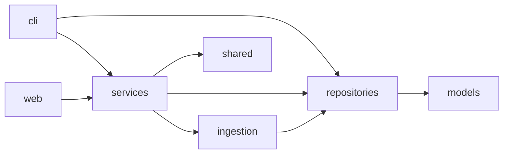

# Stock Analyze System — System Overview

## 30 秒サマリ

SEC EDGAR から米国上場企業の filing を取得し、LLM (Qwen3.6-27B / `Qwen3.6-27B-Q4_K_M.gguf`) で
ファンダメンタルズ分析を行う。Web UI からスクリーニング・分析実行可能。

## システムマップ

> 自動生成版: [Dependency Graph](generated/dependency-graph.md)

## エンドツーエンドのデータパス

1. **ingestion → repositories**: SEC EDGAR daily fetch で filing を取得し DB に保存
2. **services → LLM**: SectionExtractor が固定セクションを抽出し Qwen3.6-27B に渡す
3. **web → services**: ユーザのスクリーニング要求を `web/routes` から `services` へ

## 主要な設計上の選択肢

> P1 では L3 アーカイブを Docusaurus にコピーしないため、ADR はプレーンテキスト表記。
> archive へのリンクは P3 (archive コピー実装) で有効化する。

| 選択 | 採用 | ADR |
|------|------|-----|
| RAG 方式 | SEC 固定セクション抽出 | ADR-004 |
| 価格データ元 | Stooq (週次), Yahoo (バッチメタ) | ADR-001, ADR-003 |
| filing 自動リカバリ | ingestion 側で実施 | ADR-002 |
| ドキュメント体系 | 3 層 Living Docs | ADR-005 |

## モジュール一覧

> 自動生成版: [Module Index](generated/module-index.md)

| モジュール | 責務 | README |
|-----------|------|--------|
| `cli` | バッチ実行コマンド | _P3 で追加_ |
| `ingestion` | 外部データ取得 | _P3 で追加_ |
| `services` | 解析・RAG ワークフロー | _P2 で追加_ |
| `repositories` | DB I/O | _P3 で追加_ |
| `models` | DB スキーマ・型 | _P3 で追加_ |
| `web` | FastAPI UI | _P3 で追加_ |
| `shared` | 共通ユーティリティ | _P3 で追加_ |

## アクティブな ADR (Status: Accepted)

> P3 で archive コピーと `generated/adr-index.md` を有効化するまでは、
> リポジトリ内の `docs/adr/` を直接参照すること。

- ADR-001: Stooq 価格データソース (`docs/adr/001-stooq-historical-price-source.md`)
- ADR-002: filing 自動リカバリ (`docs/adr/002-filing-content-auto-recovery.md`)
- ADR-003: Yahoo バッチ API (`docs/adr/003-yahoo-batch-api.md`)
- ADR-004: SEC セクション抽出 (`docs/adr/004-sec-filing-section-extractor.md`)
- ADR-005: 3 層 Living Docs (`docs/adr/005-living-docs-three-layer.md`)

## いま進行中の作業

→ [`docs/current-work.md`](current-work.md)

## 始めるとき何を読むか

- **新しい機能を実装**: 該当 module の README → 関連 ADR
- **バグ修正**: 該当 module の README → 関連 spec/plan
- **レビュー**: commit 内の touched module → README diff
